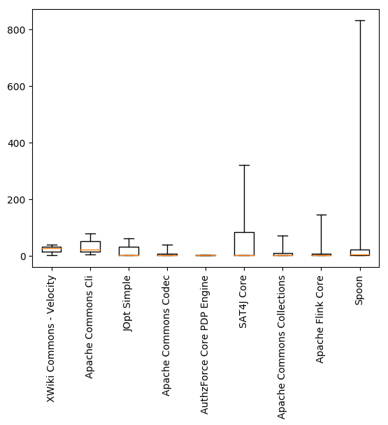

# Interplay report

## Covering tests

The following table an plot show the distribution of the number of test methods
covering a **falsifier**.

| Project | Min | Max | Mean | Std |
|---------|-----|-----|------|-----|
|XWiki Commons - Velocity|3|38|22.67|14.61|
|Apache Commons Cli|5|79|35.33|31.65|
|JOpt Simple|1|62|21.33|28.76|
|Apache Commons Codec|1|38|5.39|8.30|
|AuthzForce Core PDP Engine|1|1|1.00|0.00|
|SAT4J Core|1|321|48.70|81.29|
|Apache Commons Collections|1|71|10.75|18.13|
|Apache Flink Core|1|145|7.94|18.34|
|Spoon|1|830|45.20|124.25|
|Total|1|830|28.23|83.21|

## Stack distance

The following table an plot show the distribution of the stack distance from a 
test method to a **falsifier**.

| Project | Min | Max | Mean | Std |
|---------|-----|-----|------|-----|
|XWiki Commons - Velocity|1|10|5.91|2.28|
|Apache Commons Cli|3|9|7.08|0.89|
|JOpt Simple|2|6|4.00|0.50|
|Apache Commons Codec|1|45|13.68|13.16|
|AuthzForce Core PDP Engine|3|6|3.83|1.07|
|SAT4J Core|1|28|9.34|3.62|
|Apache Commons Collections|1|17|4.02|2.41|
|Apache Flink Core|1|23|7.21|4.08|
|Spoon|1|309|44.88|35.10|
|Total|1|309|36.29|34.37|

